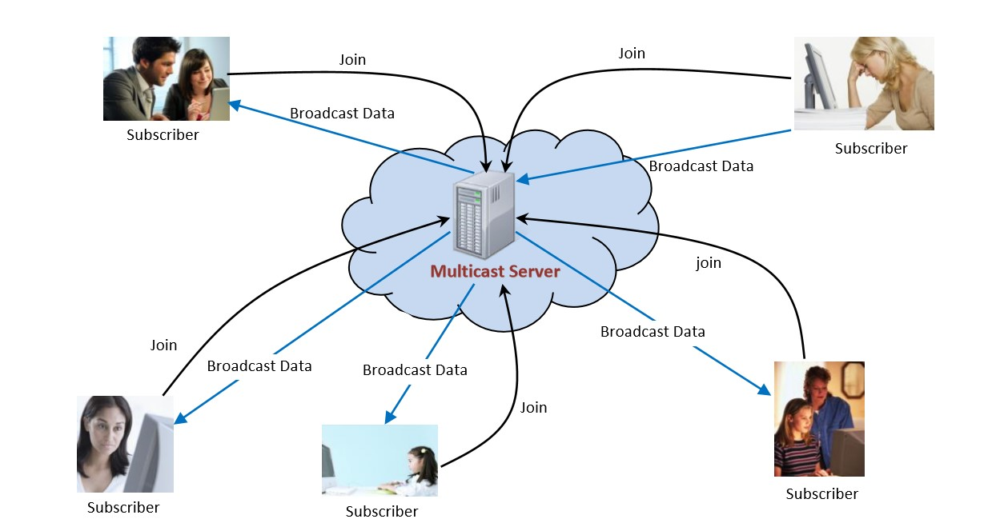

# Multicast System

This is a simple socket programming project which implements a multicast server and a client using C language (Unix/Linux machine). 

A simple illustratin as below:


## Usage

### Compile

- Client
    ```
    gcc client.c -o client.o
    ```

- Server
    ```
    gcc server.c -o server.o
    ```

### Run

- Server
    ```
    ./server.o [port number]
    ```

- Client
    ```
    ./client.o [IP address/localhost] [port number]
    ```

## Running Test

- Server
    ```
    $ ./server.o 55397
    Socket created.
    Bind completed!
    --------------------------------------
    Please create a new group: Test
    Please enter the maximum number of clients allowed: 5
    New thread created!
    --------------------------------------
    Please enter the message or select action(1. status, 2.clear all): 1
    No client connected yet.
    --------------------
    Please enter the message or select action(1. status, 2.clear all): Hi
    Please enter the message or select action(1. status, 2.clear all): Test
    Please enter the message or select action(1. status, 2.clear all): Hello
    Please enter the message or select action(1. status, 2.clear all): 1
    --------------------
    Client: 1/5
    IP address: 192.168.56.1
    Port number: 64256
    --------------------
    Client: 2/5
    IP address: 192.168.56.1
    Port number: 52050
    --------------------
    Please enter the message or select action(1. status, 2.clear all): 2
    ```

- Client
    ```
   $ ./client.o localhost 55397
    Socket created!
    Bind completed!
    --------------------------------------
    Please enter the group name you want to join: Test
    Please choose action(1. join, 2. quit): 1
    You joined the group!
    --------------------------------------
    Receiving messages:
    Hi
    Test
    Hello
    Stop receiving message from Server!
    ```

## Authors

- Zhengguan Li